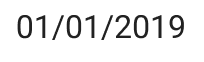
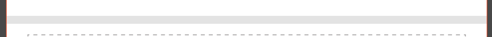

# **Provider** service description

- [**Provider** service description](#provider-service-description)
    - [Idea](#idea)
    - [Components](#components)
        - [Item](#item)
        - [Separator](#separator)
        - [Button](#button)
    - [Screen](#screen) 
    
## Idea
>>>
Приложение состоит из набора экранов (screen). Каждый экран описывается в виде джейсона, который приходит в ответе на запрос.
Экран содержит список компонент и кнопок.

Сервер покрыт авторизацией.
>>>

## Components

### Item
>>>
[Модель](https://gitlab.4u.house/4u/provider/provider-backend/blob/master/README.md#item) данных компоненты

Макет компоненты


#### Conditions
```kotlin
1. if (picture = null)
    "key" сдвигать на место "picture"
2. if (edit == "true")
    "key" and "value" отображать ярким цветом
   else
    "key" and "value" отображать тусклым цветом
3. if (request != null)
    после "value" отображать знак ">"
4. При нажатии на компоненту, по значению поля "request" отправляется запрос на получение экрана (screen)
5. Зависимость отображения "value" от поля "typeValue" смотри в таблице ниже
```
Таблица зависимости отображения "value" от поля "typeValue"

typeValue | отображение "value"
--------- | -----
switch    | 
date      | 
>>>

### Separator
>>>
[Модель](https://gitlab.4u.house/4u/provider/provider-backend/blob/master/README.md#separator) данных компоненты

Таблица зависимости отображения "separator" от поля "type"

type         | отображение
------------ | ----
text         | 
line         | 
textWithLine | 
>>>

### Button
>>>
[Модель](https://gitlab.4u.house/4u/provider/provider-backend/blob/master/README.md#button) данных компоненты

Макет компоненты


#### Conditions
1. Кнопка становится доступной для нажатия при выполнении условий поля "able", иначе отображается недоступной 
1. При нажатии кнопки по значению поля "request" отправляется запрос на получение экрана (screen)
>>>

## Screen
>>>
[Модель](https://gitlab.4u.house/4u/provider/provider-backend/blob/master/README.md#screen) данных экрана

Макет экрана


### Conditions
1. У каждого экрана в заголовке (левее "key") отображается кнопка возврата ">", по нажатию на которую осуществляется переход на предыдущий экран
1. Порядок отображения компонент соответствует порядку в списке "components"
1. Порядок отображения кнопок внизу экрана соответствует порядку в списке "button" 
>>>