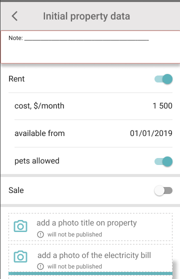

[PUT../provider/{num}/{taskClass}/{idField}]:https://gitlab.4u.house/4u/provider/provider-backend/tree/develop#putprovidernumtaskclassidfield

# **Provider** service description

- [**Provider** service description](#provider-service-description)
    - [Idea](#idea)
    - [Components](#components)
        - [Item](#item)
        - [Button](#button)
    - [Screen](#screen) 
    
## Idea
>>>
Приложение состоит из набора экранов (screen). Каждый экран описывается в виде джейсона, который приходит в ответе на запрос.
Экран содержит список компонент и кнопок.

Сервер покрыт авторизацией.
>>>

## Components

### Item
>>>
[Модель](https://gitlab.4u.house/4u/provider/provider-backend/blob/master/README.md#item) данных компоненты

Макет компоненты


#### Conditions
1. Отображение picture
    ```kotlin    
    if (picture = null)
        "key" сдвигать на место "picture"
    ```
2. Цвет, переход на другой экран, редактирование
    ```kotlin
    if (isTransition == true)
        после "value" отображать знак ">"
        при нажатии отправить запрос на получение экрана: к "path" экрана добавить "id" компоненты
    if (isInput == true)
        "key" and "value" отображать ярким цветом
        if (typeValue == switch)
            при нажатии отправить PUT запрос на редактирование: к "path" экрана добавить "/id" компоненты (ссылку на запрос см. ниже). В запросе отправить "value" компоненты
        else
            в зависимости от typeValue открыть экран ввода данных и по нажатию на "Save" отправить аналогичный PUT запрос
    else
        "key" and "value" отображать серым цветом
    ```
**Ссылка на PUT запрос - [PUT../provider/{num}/{taskClass}/{idField}][]**

5. Зависимость отображения "value" от поля "typeValue" и открытие доп. экрана смотри в таблице ниже

typeValue | отображение "value"         | экран для ввода
--------- | --------------------------- | ---
switch    |  | -
date      | 01.01.2019                  | 
money     | перед запятой начиная с конца каждые 3 знака отделять пробелом <br>если значений после запятой нет, отображать "00" <br> ex: 1 354 987.76 | 
>>>


### Button
>>>
[Модель](https://gitlab.4u.house/4u/provider/provider-backend/blob/master/README.md#button) данных компоненты

Макет компоненты


#### Conditions
1. Кнопка доступна для нажатия при `able == true`, иначе отображается недоступной 
1. При нажатии кнопки по значению поля "request" отправляется запрос на получение экрана (screen)
>>>

## Screen
>>>
[Модель](https://gitlab.4u.house/4u/provider/provider-backend/blob/master/README.md#screen) данных экрана

Макет экрана



### Conditions
1. У каждого экрана в заголовке (левее "key") отображается кнопка возврата ">". По нажатию у "path" убрать последний параметр и запросить новый экран (возврат на предущий)
1. Порядок отображения компонент соответствует порядку в списке "components"
>>>